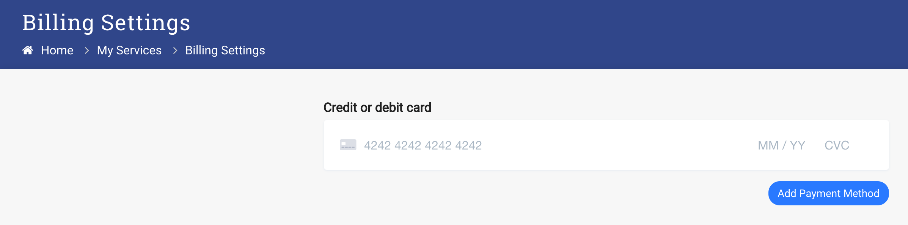

#Adding a Payment method

After a user has been created in the system, they can view all the public services and manage their account. To be able to request services the user must have a payment method configured.

1. Log in with a User account
2. Select _Billing_ -> _Billing Settings_

3. Enter your card information and select _Add Payment Method_

