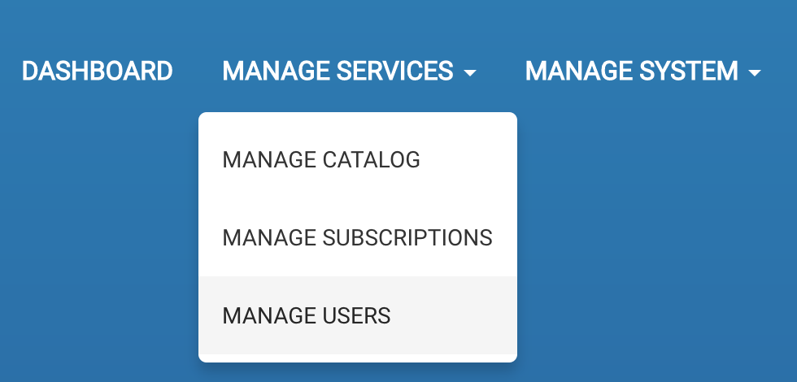
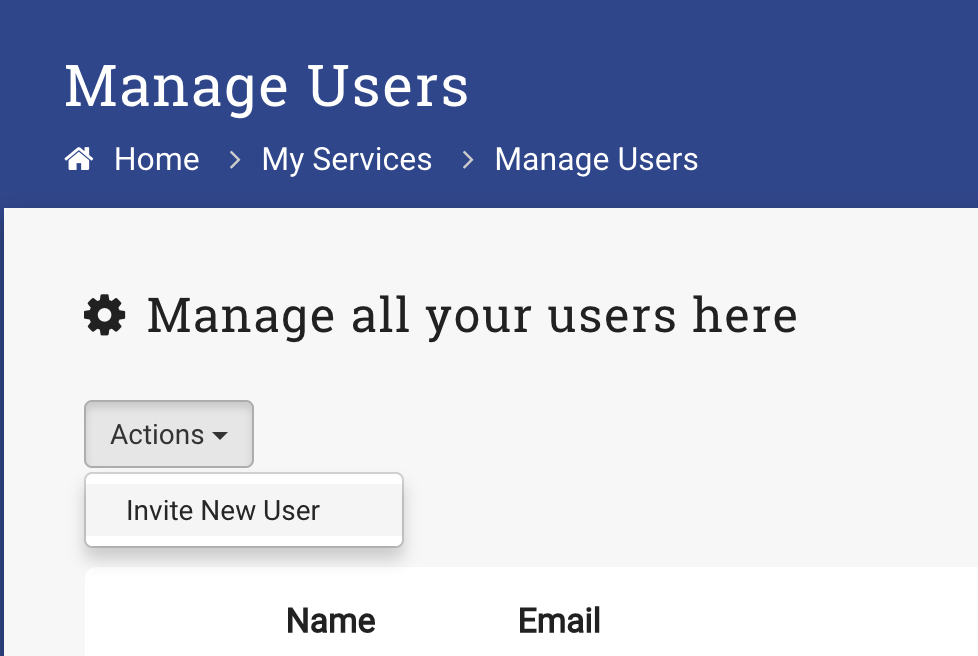

#Account Creation
There are two ways to add a user to your ServiceBot instance. As an Admin, you can add new users. As a new user to the system you can Sign up.

* As an Admin

    1. Log in as an Administrator
    2. Select _Manage Services_ -> _Manage Users_    
    
    3. Select _Actions_ -> _Invite New User_
    
    3. Enter new user email address
    TODO Continue here
    
* As a User

    1. From the homepage, Select _Sign Up_
    
    2. 
