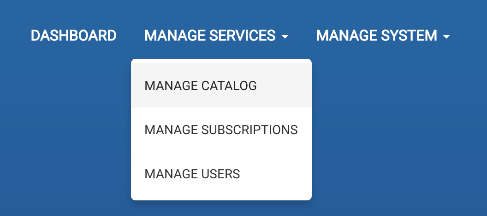
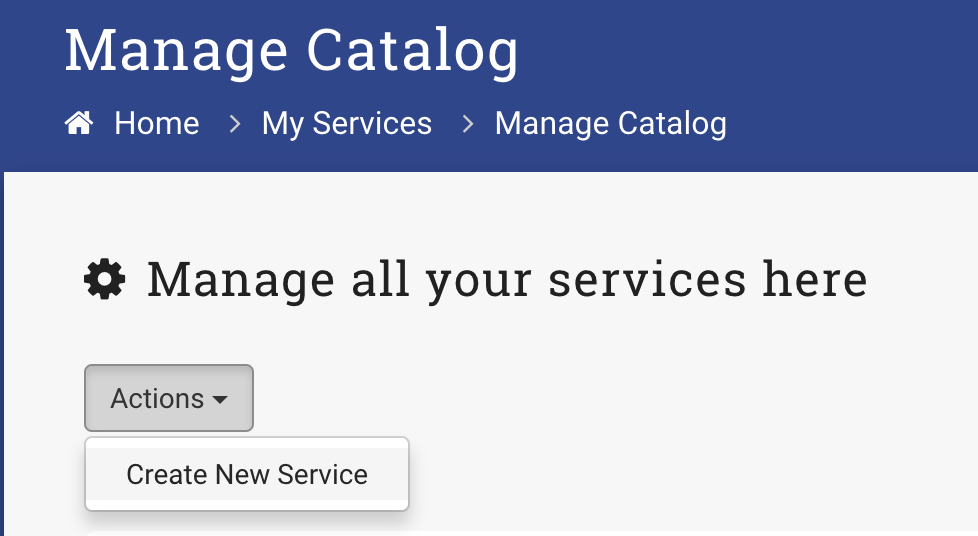

#Create a Service Template
1. Log into an Administrator account
2. Select _Manage Services_ -> _Manage Catalog_
    
3. Select _Actions_ -> _Create New Service_
    
4. Fill out the form fields provided

    | Field Name    |   Description  | Example Value  |
    | ------------- |:-------------:| -----:|
    | Service Name | Name of the service template which will be displayed on the item thumbnail from the homepage catalog | `Small Website` |
    | Summary | Summary of the service template which will be displayed on the item thumbnail from the homepage catalog |   `Development of custom small CMS managed website (less than 10 pages)` |
    | Service Details | Detailed description of the service template. This will be displayed when a user selects _view_ from the homepage catalog. You can use html tags in your service details | `We can build you a ` |
    | Published? | Whether or not this service template is to be displayed on the homepage catalog | `Yes` |
    | Category | Category for the service template to be put in. Templates can be filtered by the category on the homepage catalog | `Small Website` |
    | Service Details | are neat      |  `Small Website` |

