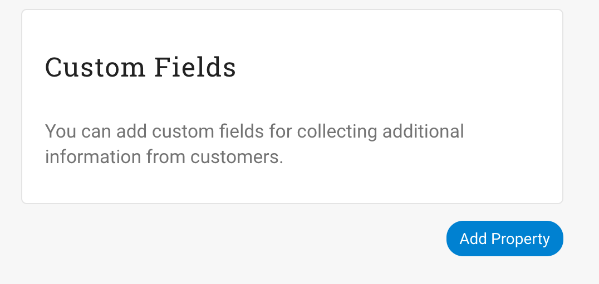
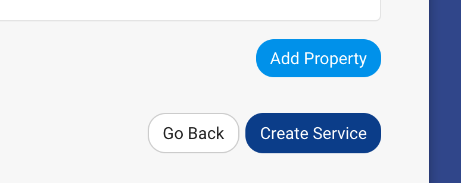

#Create a Service Template
1. Log into an Administrator account
2. Select _Manage Services_ -> _Manage Catalog_
    
3. Select _Actions_ -> _Create New Service_
    
4. Fill out the form fields provided

    | Field Name    |   Description  | Example Value  |   Possible Values   |
    | ------------- |:-------------:| -----:| -----:|
    | Service Name | Name of the service template which will be displayed on the item thumbnail from the homepage catalog | `Small Website` |
    | Summary | Summary of the service template which will be displayed on the item thumbnail from the homepage catalog |   `Development of custom small CMS managed website (less than 10 pages)` |
    | Service Details | Detailed description of the service template. This will be displayed when a user selects _view_ from the homepage catalog. You can use html tags in your service details | `We can build you a <strong>custom</strong> website!` |
    | Published? | Whether or not this service template is to be displayed on the homepage catalog | `Yes` | `Yes`, `No` |
    | Category | Category for the service template to be put in. Templates can be filtered by the category on the homepage catalog | `Web Development` | List available from Categories Created |
    | Trial Period (Days) | Number of days for a trial period of the service |  `0` | Greater than 0 |
    | Currency | Number of days for a trial period of the service |  `USD` | [Available currencies](https://support.stripe.com/questions/which-currencies-does-stripe-support) |
    | Service Type | <ul><li>Subscription Service - For reoccurring charges.</li><li>One-Time Service - For one time charges</li><li>Custom Service - For custom services whose prices can change at purchase</li></ul> |  `Subscription Service` | `Subscription Service`, `One-Time Service`, `Custom Service` |
    | Trial Period (Days) | Number of days for a trial period of the service |  `0` | Greater than 0 |
    | Service Subscription Amount | Price for the service template |  `2777.68` | Greater than 0 |
    | Subscription Interval | The time between a reoccurring service |  `Monthly` | `Daily`, `Weekly`, `Monthly`, `Yearly` |
    | How Many "Interval"? | The number of occurrences of the service |  `12` | Greater than 0 |
    | Prorated? | If your service billing should include partial time intervals. More on proration [here](https://stripe.com/docs/subscriptions/upgrading-downgrading#understanding-proration) | `Yes` | `Yes`, `No` |

5. Enter Custom Fields
    

    | Field Name    |   Description  | Example Value  |   Possible Values   |
    | ------------- |:-------------:| -----:| -----:|
    | Label | The display value for the field to be displayed in the form | `What's your name?` |
    | Input Type | The type of input for the field to be displayed in the form | `Text Box` | `Text Box`, `Select List`, `Check Box` |
    | Default Value | The default value for the field to be displayed in the form | `Jeff` |
    | Private? | If this field should be hidden from the form. Can be used to store configuration data or other cross template properties | `No` | `Yes`, `No` |
    | Required? | If this field must have a value to submit the request | `Yes` | `Yes`, `No` |
    | Prompt User | If this field should be propted for the user to fill out. If this is "No" and Private is "No", the property name and value will be displayed in the form with no option to change the value | `No` | `Yes`, `No` |

5. Click _Create Service_
    
