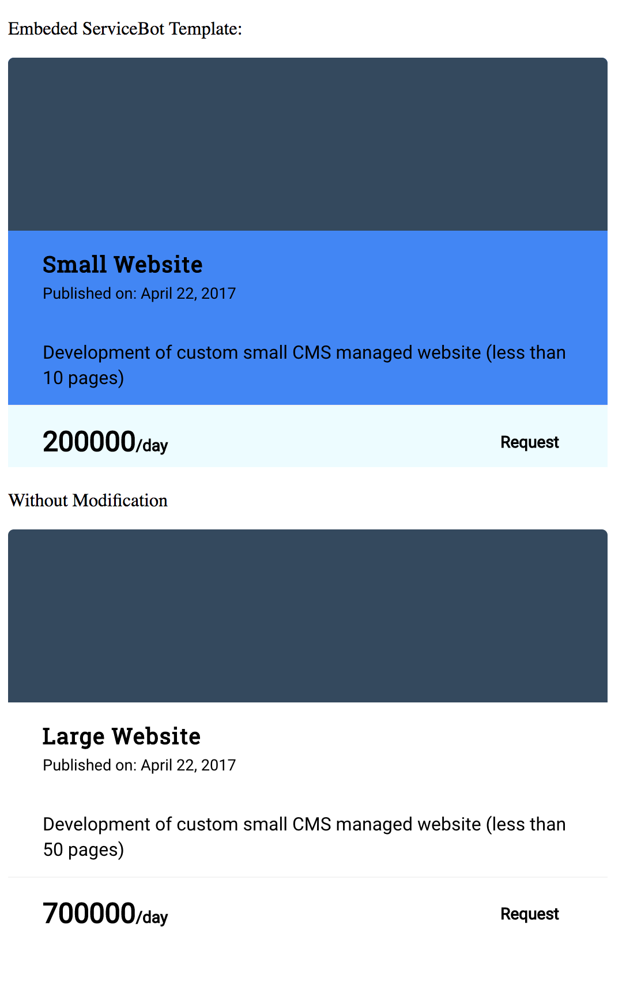

You can embed a Service Template from your Catalog into another website using iFrames

1. Service template embedding accepts the following URL query:

Example: /service/1/embed?bodyColor=444444&footerColor=000000&noDate

Options: bodyColor, footerColor, icon = [boolean], noDate, noCost, fullDescription, textColor, requestButton

2. Here is sample HTML for embedding templates from a ServiceBot instance running locally on port 3001
```
<!DOCTYPE html>
<html lang="en">
<head>
    <meta charset="UTF-8">
    <title>ServiceBot template Embed example</title>
</head>
<body>
<div>
    <p>Embeded ServiceBot Template:</p>
    <iframe src="http://localhost:3001/service/1/embed?bodyColor=4286f4&footerColor=edfcff" frameborder="0" scrolling="no" height="355" width="520"></iframe>
</div>
    <p>Without Modification</p>
    <iframe src="http://localhost:3001/service/2/embed" frameborder="0" scrolling="no" height="355" width="480"></iframe>
</body>
</html>
```

3. The result of the above HTML is here:

    

4. The user can select request which will redirect to your ServiceBot instance for checkout