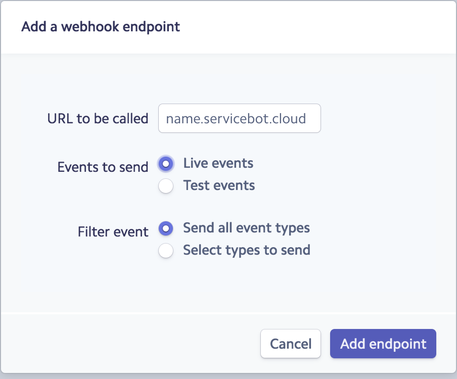

#Getting Started With ServiceBot

###Stripe Setup

ServiceBot has a very close integration with stripe so each instance 
needs to have access to Stripe API keys and have Stripe Webhooks setup
Follow the following steps in order to get everything working

####Create Stripe Account
Go to <https://dashboard.stripe.com/register> and register

####Get Stripe API Keys
ServiceBot uses Stripe APIs - when prompted in the setup enter the keys on
this page <https://dashboard.stripe.com/account/apikeys>

!!! note
    Use the live mode key if you want real transactions to occur when users
    order services, while in test mode all transactions will be faked in 
    Stripe.

####Create Stripe webhooks

In order to have ServiceBot and Stripe communicate with each other we need 
to create webhooks in stripe.

- go to <https://dashboard.stripe.com/account/webhooks>
- Create a new webhook and enter your ServiceBot url and select live mode
and send all events

 

!!! note
    Optionally you can create a test mode webhook if you would like test mode to be 
    fully connected to stripe
    
- Stripe will now communicate properly with your server.