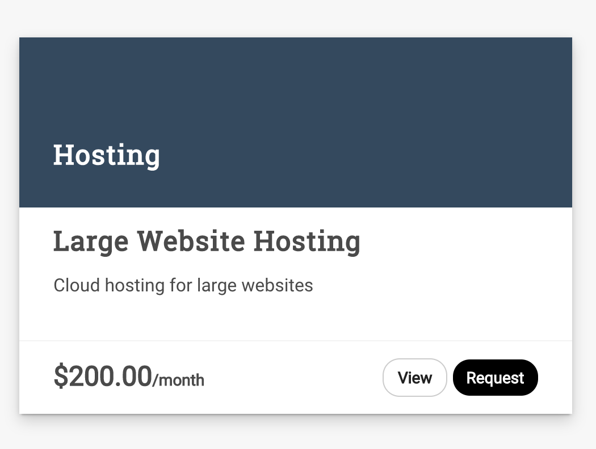

#Request a Service
There are two ways to request a service instance. As an Admin, you can requests instances on behalf of a user. As a new user to the system you can request for yourself. The same process is done for both, except if you requested on behalf of a user it will require approval from the user.

1. Log into ServiceBot instance
2. Select _Request_

3. Fill in Basic info __if you are an Administrator__

    | Field Name    |   Description  | Example Value  |   Possible Values   |
    | ------------- |:-------------:| -----:| -----:|
    | For Client | The customer who you are requesting on behalf of | `email@domain.com` |
    | Name | Name for the service instance. If you don't provide one the name will be inherited from the template it was requested from | `Small Website` |
    | Description | Description for the service instance. If you don't provide one the description will be inherited from the template it was requested from | `email@domain.com` |

    Advanced

    | Field Name    |   Description  | Example Value  |   Possible Values   |
    | ------------- |:-------------:| -----:| -----:|
    | Published? | Whether or not this service template is to be displayed on the homepage catalog | `Yes` | `Yes`, `No` |
    | Category | Category for the service template to be put in. Templates can be filtered by the category on the homepage catalog | `Web Development` | List available from Categories Created |
    | Trial Period (Days) | Number of days for a trial period of the service |  `0` | Greater than 0 |
    | Currency | Currency for the service template |  `USD` | [Available currencies](https://support.stripe.com/questions/which-currencies-does-stripe-support) |
    | Service Type | <ul><li>Subscription Service - For reoccurring charges.</li><li>One-Time Service - For one time charges</li><li>Custom Service - For custom services whose prices can change at purchase</li></ul> |  `Subscription Service` | `Subscription Service`, `One-Time Service`, `Custom Service` |
    | Trial Period (Days) | Number of days for a trial period of the service |  `0` | Greater than 0 |
    | Service Subscription Amount | Price for the service template |  `2777.68` | Greater than 0 |
    | Subscription Interval | The time between a reoccurring service |  `Monthly` | `Daily`, `Weekly`, `Monthly`, `Yearly` |
    | How Many "Interval"? | The number of occurrences of the service |  `12` | Greater than 0 |
    | Prorated? | If your service billing should include partial time intervals. More on proration [here](https://stripe.com/docs/subscriptions/upgrading-downgrading#understanding-proration) | `Yes` | `Yes`, `No` |

4. Fill in the custom fields of the form
5. Select _Submit Request_

######(Note: If you are an administrator requesting the service on behalf of a user, the instance will need to be Approved)
