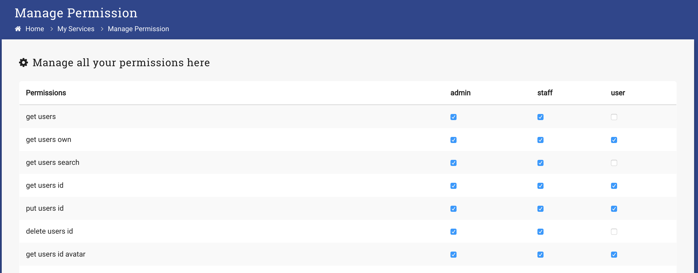

As an Administrator you can modify the permissions of a role
Each permission corresponds to an API endpoint from our [REST API](http://docs.servicebot.io)

1. Log in as Administrator
2. Select _Manage System_ -> _Manage Permission_

3. Check the permission you would like the role to have

