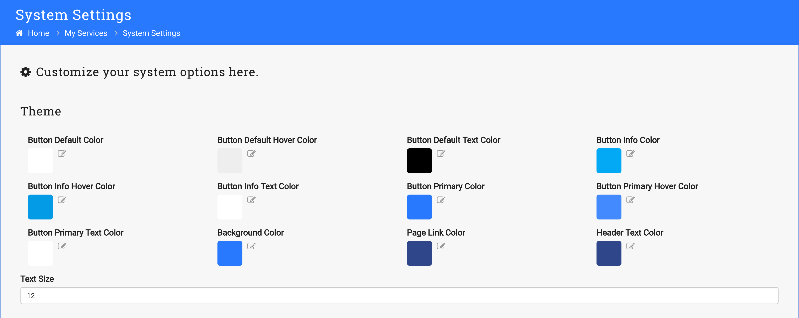
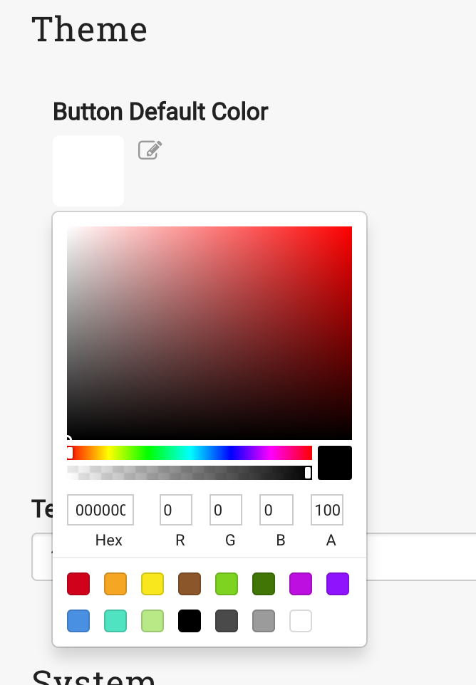

1. Log in with Administrator account
2. Select _Manage System_ -> _System Settings_

    

3. The top section of the page has theme settings

    

4. Change a color by clicking the color or 

     

5. Select _Update Settings_ to save your changes

    